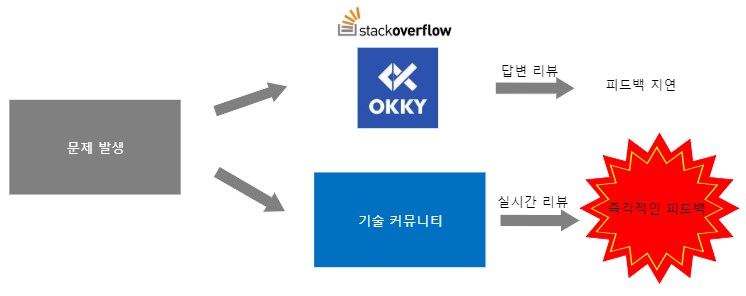

# knock-knock

**팀원: 강정구, 강민석, 오용상**

## 1. 프로젝트 개요

실시간 리뷰가 가능한 기술 커뮤니티를 제작.

문제발생시 다수가 채팅하고 코드를 공유하는 페이지를 제공하여 코딩과정에서 생길 수 있는 문제를 즉각적으로 처리 할 수 있게하는 것을 목적으로 함.

## 2. 기술 스택

> spring boot, vue, rabbitMQ, mariaDB

## 3. ERD

> 추후 업데이트

## 4. 디렉토리 구조도

> 추후 업데이트

